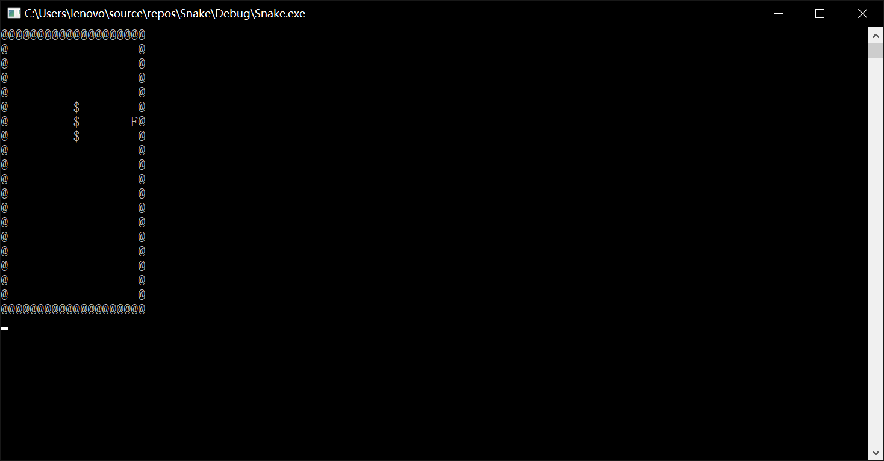
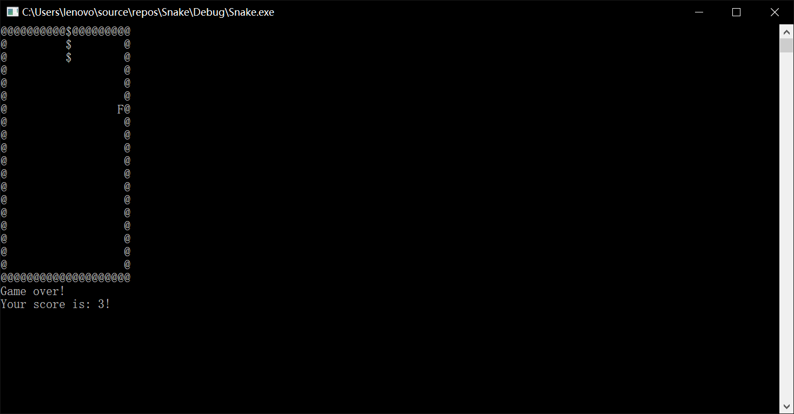

# **贪吃蛇游戏**
**贪吃蛇游戏是一款经典的益智游戏，该游戏通过控制蛇头方向吃蛋，从而使得蛇变得越来越长。**

***

## 游戏规则
通过WASD操控Snake的上左下右的移动，目标是吃到food。
当Snake触碰到Wall或者自身时，游戏结束。

***

## 游戏界面
### *开始界面*

    开始时Snake具有三个长度，即food=3。可以看到第一个food出现在右侧。Stage的规格是20x20。
### *结束界面*

    可以看到Snake触碰到上侧的Wall，Snake死亡，游戏结束。Stage下侧出现“Game over”和分数（即food的值）

***

## 程序进度
### *已实现*
* 操作Snake移动
* 基本游戏规则
* 显示死亡画面
### *待实现*
* 选择/自调整难度
* 高级死亡画面
* 更多...

