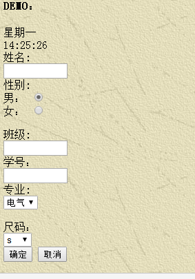

# 第一次作业
## 一、暑期demo源码
```html
<html>
<head>
<script type="text/javascript">
var d=new Date()
var weekday=new Array(7)
weekday[0]="星期日"
weekday[1]="星期一"
weekday[2]="星期二"
weekday[3]="星期三"
weekday[4]="星期四"
weekday[5]="星期五"
weekday[6]="星期六"
document.write( weekday[d.getDay()])
</script>
</body>
<script type="text/javascript">
function startTime()
{
var today=new Date()
var h=today.getHours()
var m=today.getMinutes()
var s=today.getSeconds()
m=checkTime(m)
s=checkTime(s)
document.getElementById('txt').innerHTML=h+":"+m+":"+s
t=setTimeout('startTime()',500)
}
function checkTime(i)
{
if (i<10) 
  {i="0" + i}
  return i
}
</script>
</head>
<body onload="startTime()">
<div id="txt"></div>
</body>
<body>
<body background="/i/eg_background.jpg">
<h4>DEMO：</h4>
<form action="">
姓名:<br>
<input type="text" name="" value ="" size="10">
<br>
性别:<br>
<form>
男：
<input type="radio" checked="checked" name="Sex" value="male" />
<br />
女：
<input type="radio" name="Sex" value="female" />
</form>
班级:<br>
<input type="text" name=""" size="10">
</form>
<br>
学号：<br>
<input type="text" name=""" size="10">
<br>
专业:<br>
<form>
<select name="专业">
<option value="电气">电气</option>
<option value="机械">机械</option>
<option value="土木">土木</option>
<option value="建规">建规</option>
</select>
</form>
尺码：<br>
<form>
<select name="尺码">
<option value="s">s</option>
<option value="m">m</option>
<option value="l">l</option>
<option value="xl">xl</option>
<option value="2xl">2xl</option>
<option value="3xl">3xl</option>
<option value="4xl">4xl</option>
</select>
</form>
<br>
<form>
<input type="button" value="确定">
<form>
<input type="button" value="取消">
</form>
</body>
</html>
```
---
## 二、功能介绍与说明
       1.因为对微信小程序比较感兴趣，所以自学了html的一点知识，这个demo主要是一些简要的html功能。 
       2.demo的前半部分为一个时间显示，可以展示当天为星期几，并显示实时具体时间，精确到秒数。
       3.demo的后半部分相当于一个简单的信息收集功能，运用了html的几个基本框架，如输入框、下拉框、按钮等等，进入界面后可在其中输入信息或者选择相应信息。
       下面是效果图
  
 
 

